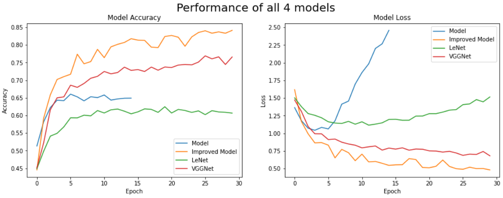

# Image Classification with Convolutional Neural Networks (CNN)

## Overview

Image classification is a critical task in computer vision applications, enabling machines to recognize and categorize images accurately. Over the years, there has been a remarkable evolution in image classification algorithms, transitioning from traditional feature-based methods to more advanced deep learning-based techniques. Among these, Convolutional Neural Networks (CNNs) have emerged as a standout success story, significantly improving classification accuracy.

## Project Description

This project, undertaken as a part of the 3rd year of the Bachelor's degree program at Newcastle University, involves the development and optimization of a CNN architecture for image classification. The primary goal is to achieve high accuracy in classifying images using deep learning techniques. Additionally, two other popular models, LeNet and VGGNet, have been implemented and compared for their performance in image classification.

## CNN Architecture

The CNN architecture is designed to extract hierarchical features from images, allowing the model to learn complex patterns and representations. The architecture includes convolutional layers, pooling layers, fully connected layers, and activation functions. The specific hyperparameters and layer configurations can be found in the codebase.

## LeNet Model

The LeNet model, pioneered by Yann LeCun, is an early and influential CNN architecture. It consists of convolutional layers with subsampling, leading to a compact yet effective model. The README provides insights into the LeNet architecture and its implementation.

## VGGNet Model

VGGNet, developed by the Visual Graphics Group at Oxford, is known for its simplicity and depth. The model comprises stacked convolutional layers with small receptive fields, followed by max-pooling layers. The README details the VGGNet architecture and its integration into the project.

## Getting Started

To use the provided CNN architecture, LeNet, and VGGNet models, follow these steps:

1. Clone the repository: `git clone https://github.com/dpoulimen0s/Image_Classification_CNN.git`
2. Navigate to the project directory
3. Install the necessary dependencies: `pip install -r requirements.txt`
4. Run the main Jupyter notebook to train and evaluate the models.

## Results

The project aims to achieve high accuracy in image classification. Performance metrics, such as accuracy, precision, recall, and F1 score, are calculated and presented in the results section. Comparative analyses between the CNN architecture, LeNet, and VGGNet provide insights into the strengths and weaknesses of each model.

## Conclusion

Image classification is a dynamic field that continues to benefit from advancements in deep learning. This project, conducted as part of the 3rd year of the Bachelor's degree at Newcastle University, showcases the effectiveness of CNNs, LeNet, and VGGNet in image classification tasks. Users are encouraged to explore and experiment with the models to gain a deeper understanding of their capabilities and limitations.

## Contributors

- Dimitrios Poulimenos ([dpoulimenos](https://www.linkedin.com/in/dpoulimenos/)) - Initial work 
